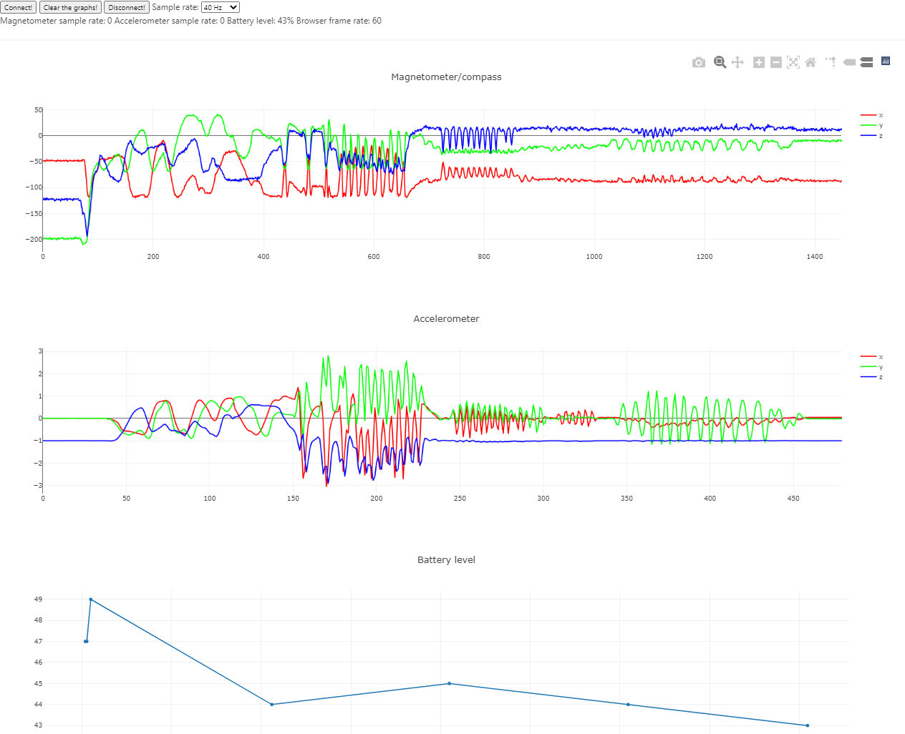

# Streaming data to the browser with web-bluetooth at 80Hz!

Demo of streaming data from the magnetometer from an Espruino Puck.JS / Bangle.JS at up to 80 Hz to the browser with Web-Bluetooth and plotting with plotly JS. In real time :)

Javascript all the way down!

## Changelog / release notes:

### v.0.3:
 - Update to work with Bangle.JS as well

### v.0.2:
 - Implemented battery level service to show how to connect to two characteristics and receive notification

# Usage
 - Upload the [PuckStreaming.js](src/PuckStreaming.js) to your Puck, or [BangleStreaming.js](src/BangleStreaming.js) to your Bangle
 - Open [index.html](src/index.html) in a browser that supports web Bluetooth (tested with Chrome, and Edge "dev")
 - Press the DoIt button & select your Puck to connect to it
 - Streaming start as soon as you are connected
 - You can change the sample speed, or stop it with the dropdown

# Code, features

### Espruino
 - defined a custom BLE service & characteristic that uses notify to "push" the data form the magnetometer (and accelerometer in case of the Bangle)
 - the characteristic is writeable, so sample rate can be changed, or turned off
 - battery level service that auto-updates every 10 seconds
 - button click toggles the LED to quickly alter battery state. Only on Puck, but you can turn on the screen of the Bangle, and that changes battery level.

### Web-Bluetooth
 - connects to the characteristics from the web page & subscribe to notifications
 - display magnetometer and battery level with Plotly.JS

## Serialization & deserialization

The magnetometer outputs three integers, for example: `{ x: 1, y:2, z: 3 }`
 so just used an `Int32Array`'s `buffer` write the data: `new Int32Array([d.x, d.y, d.z]).buffer`.

On the browser side did the reverse: created an Int32Array from the received buffer: `new Int32Array(raw.buffer)`. X is the 0th, y is the 1st, z is the 2nd element in the Int32Array.

## Tricky parts?
There were two things that caused some hangup:

Plotly with the default SVG doesn't really like work with lots of points updating all the time. Solution: use `scattergl`

Trying to update the screen at 80Hz really dragged my browser, took almost half minute to set the sample rate back to 40Hz. 40 Hz was working fine, so I guess my screen update rate is 60Hz. Simply using `window.requestAnimationFrame` to send new data to Plotly only on available animation frames solved this.

Shaky cam video: https://www.youtube.com/watch?v=72ViaRna7ZM (not really visible, but after 13 seconds I move the Puck over my laptop's speaker, so magnetometer values skyrocket)